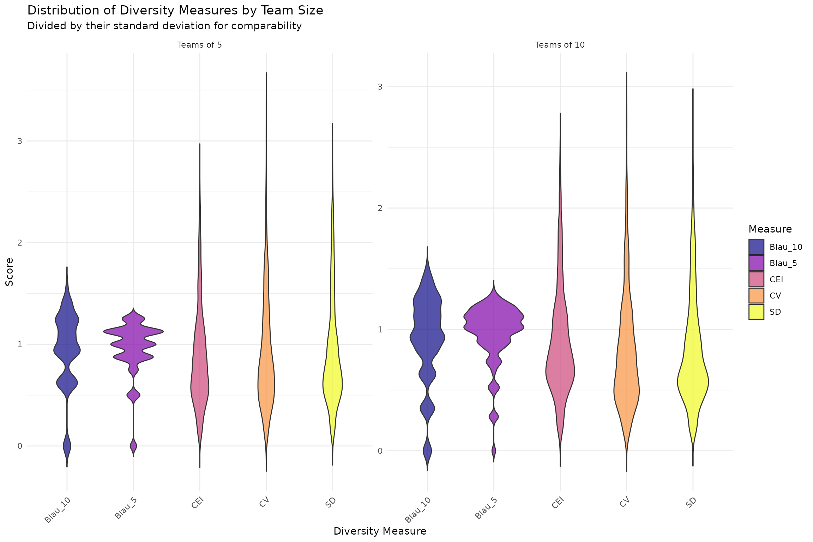
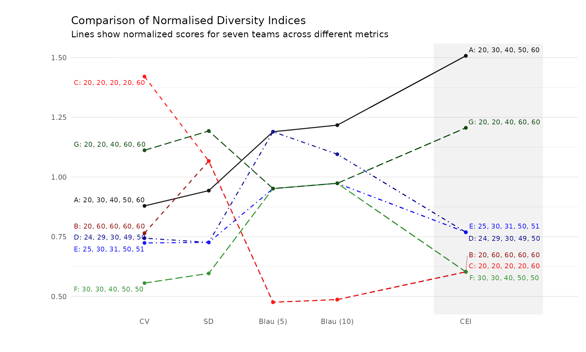
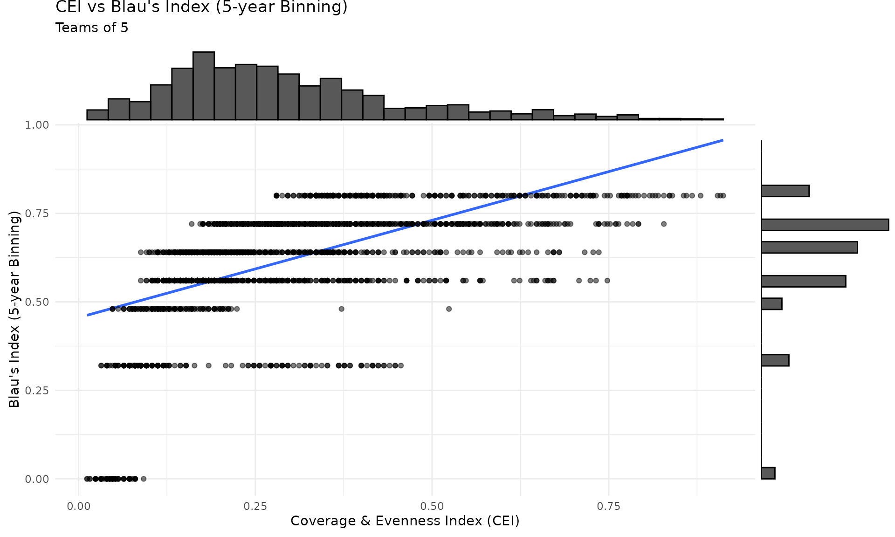
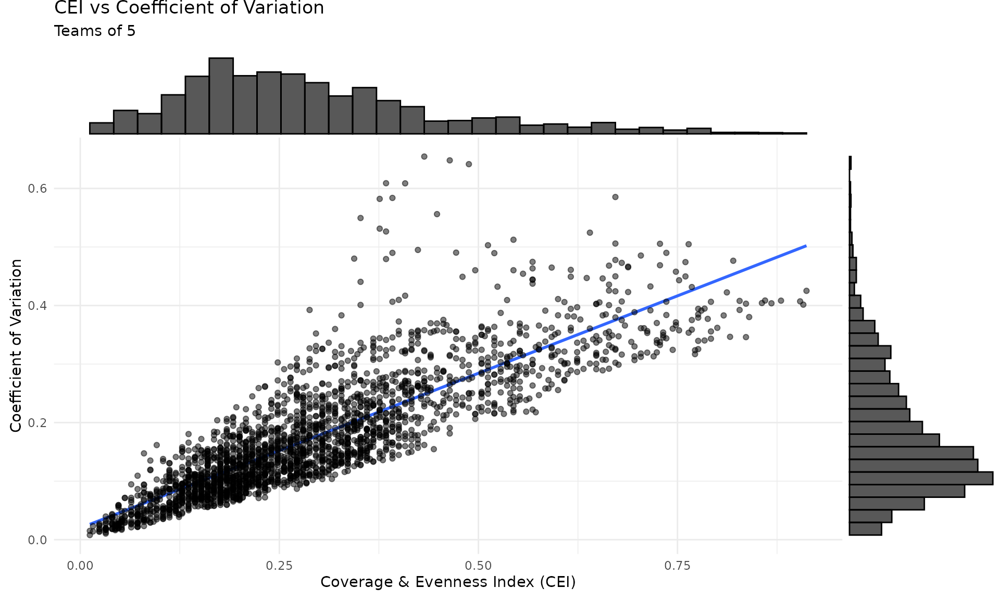
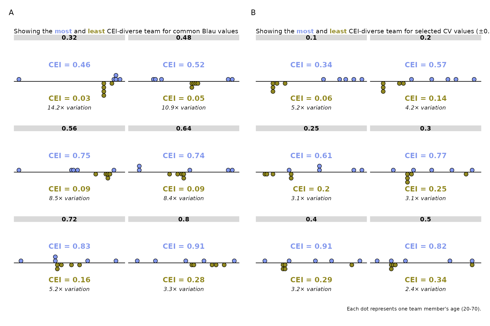

# Comparing metrics for continuous attributes

``` r
# Prefer the development version when rendering from the package repo.
pkg_root <- tryCatch(rprojroot::find_package_root_file(), error = function(e) NULL)
if (!is.null(pkg_root) && requireNamespace("devtools", quietly = TRUE)) {
  devtools::load_all(pkg_root, quiet = TRUE)
} else {
  library(divMetrics)
}
library(dplyr)
#> 
#> Attaching package: 'dplyr'
#> The following objects are masked from 'package:stats':
#> 
#>     filter, lag
#> The following objects are masked from 'package:base':
#> 
#>     intersect, setdiff, setequal, union
library(ggplot2)
library(purrr)
library(GGally)
library(viridis)  # For color scales
#> Loading required package: viridisLite
library(ggrepel) # For text annotation in chart
library(ggtext)
library(tidyr)
library(gt)  # For tables

# Load internal helper functions (not part of the public API)
cor_matrix <- divMetrics:::cor_matrix
report_cor_table <- divMetrics:::report_cor_table
line_to_vector <- divMetrics:::line_to_vector

# Source team generation helper (lives in inst/scripts, not in R/)
tg_path <- system.file("scripts", "team_generation.R", package = "divMetrics")
if (tg_path == "" && !is.null(pkg_root)) {
  tg_path <- file.path(pkg_root, "inst", "scripts", "team_generation.R")
}
source(tg_path)
```

## Introduction

This analysis aims to calculate and compare diversity scores for teams
of size 5 and 10, drawn from an age distribution ranging from 20 to 70.
We will use the following diversity measures:

1.  Blau’s Index with 5-year binning
2.  Blau’s Index with 10-year binning
3.  Coefficient of Variation (CV)
4.  Standard Deviation (SD)
5.  Coverage & Evenness Index (CEI)

## Generate Team Data

``` r
set.seed(123)  # Set seed for reproducibility

# Use the same mix of plausible staffing patterns as in the statistical power
# vignette so both analyses rely on a consistent team-generation process.
team_profile_probs <- c(
  single_cohort = 0.05,
  career_ladder = 0.10,
  balanced_roles = 0.35,
  compact_balanced = 0.45,
  tokenism = 0.05
)

generate_team <- function(size, n_teams, ...) {
  generate_age_teams(size, n_teams, profile_probs = team_profile_probs, ...)
}

# Create teams of size 5 and 10 with controlled diversity
teams_size_5 <- generate_team(5, 2500)
teams_size_10 <- generate_team(10, 2500)

# Combine all teams
teams <- bind_rows(teams_size_5, teams_size_10)
```

## Calculate Diversity Scores

### Calculate Scores

For clarity, we calculate each metric separately and then join them.
Alternatively, you could use
[`compute_all_metrics()`](https://lukaswallrich.github.io/divMetrics/reference/compute_all_metrics.md)
for a more concise approach.

``` r
# Calculate each metric separately for clarity
div_scores <- teams %>%
  group_by(team_id, team_size) %>%
  summarise(
    CEI = compute_CEI(age, range = c(20, 70)),
    Blau_5 = compute_Blau(age, bins = seq(20, 70, by = 5)),
    Blau_10 = compute_Blau(age, bins = seq(20, 70, by = 10)),
    CV = compute_cv(age),
    SD = compute_sd(age),
    group_members = paste(age, collapse = ","),
    .groups = "drop"
  )
```

## Visualize Diversity Score Distributions

To compare the distribution of all diversity measures across different
team sizes, we use violin plots faceted by team size. This approach,
using *normalized* scores, provides a clear visualization of the
distribution shape and spread for each measure. This highlights that
Blau index values are not-continuous and heavily influenced by binning
choices, while CEI, CV, and SD show smooth distributions.

``` r
# Reshape data to long format for easier plotting
div_long <- div_scores %>%
  # Normalize by dividing by SD
  mutate(across(CEI:SD, ~c(scale(.x, center = FALSE)))) %>%
  pivot_longer(
    cols = CEI:SD,
    names_to = "Measure",
    values_to = "Value"
  ) %>%
  mutate(
    team_size = paste("Teams of", team_size) %>%
      factor(levels = c("Teams of 5", "Teams of 10"))
  )

# Create violin plots
ggplot(div_long, aes(x = Measure, y = Value, fill = Measure)) +
  geom_violin(trim = FALSE, alpha = 0.7) +
  facet_wrap(~ team_size, scales = "free") +
  scale_fill_viridis(discrete = TRUE, option = "C") +
  labs(
    title = "Distribution of Diversity Measures by Team Size",
    subtitle = "Divided by their standard deviation for comparability",
    x = "Diversity Measure",
    y = "Score",
    fill = "Measure"
  ) +
  theme_minimal() +
  theme(axis.text.x = element_text(angle = 45, hjust = 1))
```



## Correlation Analysis

``` r
cor_mat <- div_scores %>%
  select(CEI:SD) %>%
  cor_matrix()

cor_mat %>% report_cor_table()
```

| Variable                                                                                                      | M    | SD   | 1                         | 2                         | 3                         | 4                         | 5   |
|---------------------------------------------------------------------------------------------------------------|------|------|---------------------------|---------------------------|---------------------------|---------------------------|-----|
| 1\. CEI                                                                                                       | 0.30 | 0.16 | \-                        |                           |                           |                           |     |
| 2\. Blau_5                                                                                                    | 0.62 | 0.16 | 0.57 \[0.55, 0.58\]\*\*\* | \-                        |                           |                           |     |
| 3\. Blau_10                                                                                                   | 0.48 | 0.19 | 0.72 \[0.70, 0.73\]\*\*\* | 0.79 \[0.78, 0.80\]\*\*\* | \-                        |                           |     |
| 4\. CV                                                                                                        | 0.17 | 0.10 | 0.81 \[0.80, 0.82\]\*\*\* | 0.35 \[0.33, 0.38\]\*\*\* | 0.53 \[0.51, 0.55\]\*\*\* | \-                        |     |
| 5\. SD                                                                                                        | 7.19 | 4.08 | 0.88 \[0.88, 0.89\]\*\*\* | 0.37 \[0.34, 0.39\]\*\*\* | 0.58 \[0.56, 0.59\]\*\*\* | 0.92 \[0.92, 0.93\]\*\*\* | \-  |
| Note. Values are Pearson correlations with 95% CIs in brackets. \*\*\* p \< .001, \*\* p \< .01, \* p \< .05. |      |      |                           |                           |                           |                           |     |

``` r

cei_cors <- cor_mat[, "CEI"]
cei_cors <- cei_cors[names(cei_cors) != "CEI"]
cei_cor_range <- range(cei_cors)
```

Key points to note:

- CEI is related to both variety and variance-based measures, with
  correlation coefficients ranging from about 0.6 to 0.9.
- Blau’s index depends on the width and alignment of bins; continuous
  CEI avoids these binning artefacts.

However, the specific correlation values depend on the simulation
parameters. As will be shown below, different team configurations can
lead to substantial divergence between measures - and the extent to
which these teams appear in real-world samples will influence
divergences between measures.

## Illustrative comparison

``` r
example_teams <- bind_rows(
  tibble(ages = c(20, 30, 40, 50, 60), team = "A"),
  tibble(ages = c(20, 60, 60, 60, 60), team = "B"),
  tibble(ages = c(20, 20, 20, 20, 60), team = "C"),
  tibble(ages = c(24, 29, 30, 49, 50), team = "D"),
  tibble(ages = c(25, 30, 31, 50, 51), team = "E"),
  tibble(ages = c(30, 30, 40, 50, 50), team = "F"),
  tibble(ages = c(20, 20, 40, 60, 60), team = "G")
)

# Calculate metrics for each team
example_scores <- example_teams %>%
  group_by(team) %>%
  summarise(
    CEI = compute_CEI(ages, range = c(20, 70)),
    Blau_5 = compute_Blau(ages, bins = seq(20, 70, by = 5)),
    Blau_10 = compute_Blau(ages, bins = seq(20, 70, by = 10)),
    CV = compute_cv(ages),
    SD = compute_sd(ages),
    team_members = paste(ages, collapse = ", "),
    .groups = "drop"
  )

# Quick comparison option using built-in plotting function:
# plot_metric_comparison(example_scores,
#   metrics = c("CV", "SD", "Blau_5", "Blau_10", "CEI"),
#   group_var = "team",
#   group_members_var = "team_members",
#   title = "Comparison of Normalised Diversity Indices")

# For this analysis, we create a custom visualization with detailed
# styling:

example_scores_long <- example_scores %>%
  pivot_longer(
    cols = c(CV, SD, Blau_5, Blau_10, CEI),
    names_to = "Index",
    values_to = "Score"
  ) %>%
  group_by(Index) %>%
  mutate(Score = scale(Score, center = FALSE)) %>%
  ungroup() %>%
  mutate(
    indicator_type = factor(
      if_else(
        Index %in% c("CV", "SD", "Blau_5", "Blau_10"),
        "Established Indicators",
        "Coverage & Evenness Index"
      ),
      levels = c("Established Indicators", "Coverage & Evenness Index")
    )
  )

# Reorder factor levels for Index and create numeric x positions
# This allows lines to connect across the two indicator groups
example_scores_long <- example_scores_long %>%
  mutate(
    Index = factor(
      Index,
      levels = c("CV", "SD", "Blau_5", "Blau_10", "CEI")
    ),
    # Map indices to numeric positions with a gap between groups
    x_pos = case_when(
      Index == "CV" ~ 1,
      Index == "SD" ~ 2,
      Index == "Blau_5" ~ 3,
      Index == "Blau_10" ~ 4,
      Index == "CEI" ~ 6
    )
  )

# Define line types and colors to highlight clusters:
line_types <- c(
  "A" = "solid",
  "B" = "dashed", "C" = "dashed",
  "D" = "dotdash", "E" = "dotdash",
  "F" = "longdash", "G" = "longdash"
)

team_colors <- c(
  "A" = "black",
  "B" = "darkred",  "C" = "red",
  "D" = "darkblue", "E" = "blue",
  "F" = "forestgreen", "G" = "#004000"
)

# Create the base plot with numeric x positions to allow line connections
p <- ggplot(
  example_scores_long,
  aes(
    x = x_pos, y = Score, group = team,
    linetype = team, color = team
  )
) +
  geom_line(aes(linewidth = team)) +
  geom_point() +
  # Add subtle background sections to distinguish indicator types
  annotate("rect", xmin = 0.5, xmax = 4.5, ymin = -Inf, ymax = Inf,
           alpha = 0.1, fill = "white") +
  annotate("rect", xmin = 5.5, xmax = 7.2, ymin = -Inf, ymax = Inf,
           alpha = 0.1, fill = "#807f7f") +
  scale_linetype_manual(values = line_types) +
  scale_color_manual(values = team_colors) +
  scale_linewidth_manual(values = c(
    "A" = 0.6, "B" = 0.6, "C" = 0.6,
    "D" = 0.6, "E" = 0.6, "F" = 0.6, "G" = 0.6
  )) +
  labs(
    title = "Comparison of Normalised Diversity Indices",
    subtitle = paste(
      "Lines show normalized scores for seven teams",
      "across different metrics"
    ),
    x = "", y = ""
  ) +
  theme_minimal() +
  theme(
    legend.position = "none",
    plot.margin = margin(t = 20, r = 10, b = 20, l = 50),
    panel.grid.major.x = element_blank(),
    panel.grid.minor.x = element_blank()
  ) +
  scale_x_continuous(
    breaks = c(1, 2, 3, 4, 6),
    labels = c("CV", "SD", "Blau (5)", "Blau (10)", "CEI"),
    expand = expansion(mult = c(0.08, 0.08))
  )

# Add labels on the left (at CV)
label_data_left <- example_scores_long %>%
  filter(Index == "CV") %>%
  select(x_pos, team, Score, team_members)

p <- p + geom_text_repel(
  data = label_data_left,
  aes(label = paste0(team, ": ", team_members), x = x_pos, y = Score),
  nudge_x = -0.6,
  vjust = 0.5,
  size = 3,
  direction = "y",
  segment.size = 0.3,
  segment.alpha = 0.5
)

# Add labels on the right (at CEI)
label_data_right <- example_scores_long %>%
  filter(Index == "CEI") %>%
  select(x_pos, team, Score, team_members)

p <- p + geom_text_repel(
  data = label_data_right,
  aes(label = paste0(team, ": ", team_members), x = x_pos, y = Score),
  nudge_x = 0.6,
  vjust = 0.5,
  size = 3,
  direction = "y",
  segment.size = 0.3,
  segment.alpha = 0.5
)

p
```



Key points to note:

- Teams B and C diverge hugely on the CV, but are identical on all other
  indices. This highlights that CV’s scaling by the mean captures a
  unique aspect that needs to be theoretically justified.
- Teams D and E substantially differ on the indices that depend on
  binning
  - even though E is simply one year older than D. This discontinuity
    highlights a key issue with binning.
- Within this example, each operationalisation of diversity results in a
  different ranking of teams. This highlights that the choice of measure
  matters (though in practice, many teams will be similar across
  measures).

## Divergence between the measures

Next we explore *where* diversity measures diverge. For that, we plot
the associations and identify the greatest residuals. These cases can
then help identify which measure best identifies diverse teams.

### Comparing Blau’s Index and CEI

Blau’s index and CEI are correlated, yet each level of Blau’s index
corresponds to a range of CEI values. We explore these deviations below.

``` r
p <- div_scores %>%
  filter(team_size == 5) %>%
  ggplot(aes(x = CEI, y = Blau_5)) +
  geom_smooth(method = "lm", se = FALSE) +
  geom_point(alpha = 0.5) +
  scale_color_viridis(discrete = TRUE, option = "D") +
  theme_minimal() +
  labs(
    title = "CEI vs Blau's Index (5-year Binning)",
    subtitle = "Teams of 5",
    x = "Coverage & Evenness Index (CEI)",
    y = "Blau's Index (5-year Binning)"
  )

p %>%
  ggExtra::ggMarginal(p, type = "histogram")
#> `geom_smooth()` using formula = 'y ~ x'
#> `geom_smooth()` using formula = 'y ~ x'
#> `geom_smooth()` using formula = 'y ~ x'
```



``` r


outliers <- div_scores %>% 
  filter(team_size == 5) %>%
  group_by(Blau_5 = round(Blau_5, 2)) %>% 
  mutate(count = n()) %>% 
  arrange(CEI) %>%
  # select the largest and smallest CEI per group
  filter(CEI == max(CEI, na.rm = TRUE) | CEI == min(CEI, na.rm = TRUE)) %>% 
  mutate(score_type = ifelse(CEI == max(CEI, na.rm = TRUE), "max", "min")) %>% 
  select(CEI, Blau_5, group_members, team_size, score_type, count) %>% 
  ungroup() %>% 
  group_by(Blau_5) %>%
  arrange(CEI) %>% 
  filter(row_number() == 1 | row_number() == n(), n() > 1) %>% # exclude if there is only 1 team (v rare), otherwise filter 1 min and 1 max
  ungroup()
```

### Comparing the Coefficient of Variation and CEI

``` r
p <- div_scores %>%
  filter(team_size == 5) %>%
  ggplot(aes(x = CEI, y = CV)) +
  geom_smooth(method = "lm", se = FALSE) +
  geom_point(alpha = 0.5) +
  scale_color_viridis(discrete = TRUE, option = "D") +
  theme_minimal() +
  labs(
    title = "CEI vs Coefficient of Variation",
    subtitle = "Teams of 5",
    x = "Coverage & Evenness Index (CEI)",
    y = "Coefficient of Variation"
  )

p %>%
  ggExtra::ggMarginal(p, type = "histogram")
#> `geom_smooth()` using formula = 'y ~ x'
#> `geom_smooth()` using formula = 'y ~ x'
#> `geom_smooth()` using formula = 'y ~ x'
```



``` r


outliers <- div_scores %>%
  filter(team_size == 5) %>%
  group_by(CV = round(2*CV, 1)/2, team_size) %>% 
  mutate(count = n()) %>% 
  arrange(CV) %>%
  # select the largest and smallest CEI per group
  filter(CEI == max(CEI, na.rm = TRUE) | CEI == min(CEI, na.rm = TRUE)) %>% 
  mutate(score_type = ifelse(CEI == max(CEI, na.rm = TRUE), "max", "min")) %>% 
  select(CEI, CV, group_members, team_size, score_type, count) %>% 
  ungroup() %>% 
  group_by(CV) %>%
  arrange(CEI) %>%
  filter(row_number() == 1 | row_number() == n(), n() > 1) %>% # exclude if there is only 1 team (v rare), otherwise filter 1 min and 1 max
  ungroup()
```

### Combined Divergence Visualization

Figure 1 below shows, for common values of Blau’s Index (Panel A) and
the Coefficient of Variation (Panel B), teams with the highest and
lowest CEI. This highlights that:

- For Blau’s Index: CEI can vary substantially (up to 4-fold) even when
  Blau is constant, reflecting different distributions with the same
  binned categories.
- For CV: Particularly for intermediate CV values, CEI can vary widely.
  Towards high CV values, the relationship can reverse as evenness
  drops.

``` r
library(patchwork)
(p_div_blau + labs(title = "")) + (p_div_cv + labs(title = "")) +
  plot_layout(ncol = 2) + plot_annotation(tag_levels = 'A')
```



### Decomposing CEI for Divergent Teams

Table 1 breaks down CEI into its Coverage (C) and Evenness (E)
components for the teams shown in Figure 1. This reveals whether
divergences are driven by differences in spread across the attribute
range (Coverage) or uniformity of distribution (Evenness).

``` r
# Combine both tables with clear section headers
combined_table_data <- bind_rows(
  blau_table_data %>%
    rename(Group = Blau_Group) %>%
    mutate(
      Metric = "Blau Index",
      Group = as.character(Group),
      .before = 1
    ),
  cv_table_data %>%
    rename(Group = CV_Group) %>%
    mutate(Metric = "Coefficient of Variation", .before = 1)
)

combined_table_data %>%
  gt(groupname_col = "Metric", rowname_col = "Group") %>%
  tab_header(
    title = "Coverage & Evenness Index (CEI) Components",
    subtitle = paste(
      "Broken down by Coverage (C) and Evenness (E) for teams",
      "shown in Figure 1"
    )
  ) %>%
  cols_label(
    Type = "Type",
    CEI = "CEI",
    C = "Coverage (C)",
    E = "Evenness (E)"
  ) %>%
  fmt_number(
    columns = c(CEI, C, E),
    decimals = 3
  ) %>%
  tab_options(
    row_group.as_column = FALSE,
    container.overflow.x = TRUE
  )
```

| Coverage & Evenness Index (CEI) Components                               |          |       |              |              |
|--------------------------------------------------------------------------|----------|-------|--------------|--------------|
| Broken down by Coverage (C) and Evenness (E) for teams shown in Figure 1 |          |       |              |              |
|                                                                          | Type     | CEI   | Coverage (C) | Evenness (E) |
| Blau Index                                                               |          |       |              |              |
| 0.32                                                                     | Low CEI  | 0.032 | 0.080        | 0.400        |
| 0.32                                                                     | High CEI | 0.456 | 1.000        | 0.456        |
| 0.48                                                                     | Low CEI  | 0.048 | 0.060        | 0.800        |
| 0.48                                                                     | High CEI | 0.524 | 0.780        | 0.672        |
| 0.56                                                                     | Low CEI  | 0.088 | 0.140        | 0.629        |
| 0.56                                                                     | High CEI | 0.748 | 0.940        | 0.796        |
| 0.64                                                                     | Low CEI  | 0.088 | 0.140        | 0.629        |
| 0.64                                                                     | High CEI | 0.736 | 0.920        | 0.800        |
| 0.72                                                                     | Low CEI  | 0.160 | 0.220        | 0.727        |
| 0.72                                                                     | High CEI | 0.828 | 0.940        | 0.881        |
| 0.8                                                                      | Low CEI  | 0.280 | 0.320        | 0.875        |
| 0.8                                                                      | High CEI | 0.912 | 0.960        | 0.950        |
| Coefficient of Variation                                                 |          |       |              |              |
| 0.1                                                                      | Low CEI  | 0.064 | 0.120        | 0.533        |
| 0.1                                                                      | High CEI | 0.336 | 0.380        | 0.884        |
| 0.2                                                                      | Low CEI  | 0.136 | 0.200        | 0.680        |
| 0.2                                                                      | High CEI | 0.572 | 0.620        | 0.923        |
| 0.25                                                                     | Low CEI  | 0.196 | 0.260        | 0.754        |
| 0.25                                                                     | High CEI | 0.608 | 0.720        | 0.844        |
| 0.3                                                                      | Low CEI  | 0.248 | 0.580        | 0.428        |
| 0.3                                                                      | High CEI | 0.772 | 0.780        | 0.990        |
| 0.4                                                                      | Low CEI  | 0.288 | 0.680        | 0.424        |
| 0.4                                                                      | High CEI | 0.908 | 0.940        | 0.966        |
| 0.5                                                                      | Low CEI  | 0.344 | 0.800        | 0.430        |
| 0.5                                                                      | High CEI | 0.820 | 0.940        | 0.872        |

## Sensitivity to range specification

CEI uses the *width* of the theoretical range (the denominator of the
coverage component) but not its absolute location. This implies two
practically useful properties:

1.  **Translation invariance**: shifting both endpoints by the same
    amount (but keeping the range width constant) leaves CEI unchanged.
2.  **Width sensitivity**: specifying a substantially wider theoretical
    range compresses CEI values (lower coverage for the same observed
    spread). When the *same* range is applied to all teams, this changes
    absolute values but not rankings (it rescales all CEI values by the
    same constant factor).

``` r
team_ceis <- teams %>%
  group_by(team_id) %>%
  summarise(ages = list(age), .groups = "drop")

# 1) Translation invariance: same span (50 years), different endpoints
translation_ranges <- tibble::tibble(
  label = c("20–70 (reference)", "0–50 (shifted)", "40–90 (shifted)"),
  lower = c(20, 0, 40),
  upper = c(70, 50, 90)
)

cei_translation <- team_ceis
for (i in seq_len(nrow(translation_ranges))) {
  current <- translation_ranges[i, ]
  cei_translation <- cei_translation %>%
    mutate(
      !!current$label := purrr::map_dbl(
        ages,
        compute_CEI,
        range = c(current$lower, current$upper)
      )
    )
}

translation_mat <- cei_translation %>%
  select(all_of(translation_ranges$label)) %>%
  cor(use = "complete.obs") %>%
  round(3)

max_abs_diff <- max(abs(cei_translation[[translation_ranges$label[1]]] -
  cei_translation[[translation_ranges$label[2]]]),
na.rm = TRUE)

cat("Translation invariance check (all spans = 50 years):\n")
#> Translation invariance check (all spans = 50 years):
print(translation_mat)
#>                   20–70 (reference) 0–50 (shifted) 40–90 (shifted)
#> 20–70 (reference)                 1              1               1
#> 0–50 (shifted)                    1              1               1
#> 40–90 (shifted)                   1              1               1
cat("\nMax |CEI(reference) - CEI(shifted)|:", signif(max_abs_diff, 3), "\n\n")
#> 
#> Max |CEI(reference) - CEI(shifted)|: 0

# 2) Width sensitivity: wider theoretical ranges (all include 20–70)
width_ranges <- tibble::tibble(
  label = c("20–70 (50y)", "15–75 (60y)", "10–80 (70y)", "0–100 (100y)"),
  lower = c(20, 15, 10, 0),
  upper = c(70, 75, 80, 100)
)

cei_width <- team_ceis
for (i in seq_len(nrow(width_ranges))) {
  current <- width_ranges[i, ]
  cei_width <- cei_width %>%
    mutate(
      !!current$label := purrr::map_dbl(
        ages,
        compute_CEI,
        range = c(current$lower, current$upper)
      )
    )
}

width_cols <- cei_width %>% select(all_of(width_ranges$label))

width_summary <- tibble::tibble(
  Range = width_ranges$label,
  `Range width (years)` = width_ranges$upper - width_ranges$lower,
  `Correlation with 20–70` = sapply(width_ranges$label, function(lbl) {
    cor(width_cols[[lbl]], width_cols[["20–70 (50y)"]], use = "complete.obs")
  }),
  `Rank correlation with 20–70` = sapply(width_ranges$label, function(lbl) {
    cor(width_cols[[lbl]], width_cols[["20–70 (50y)"]], method = "spearman", use = "complete.obs")
  }),
  `Mean CEI` = sapply(width_ranges$label, function(lbl) mean(width_cols[[lbl]], na.rm = TRUE))
) %>%
  mutate(across(c(`Correlation with 20–70`, `Rank correlation with 20–70`, `Mean CEI`), ~ round(.x, 3)))

width_summary %>%
  gt() %>%
  tab_header(
    title = "CEI sensitivity to the width of the specified range",
    subtitle = "Range width rescales CEI (mean changes) but rankings are unchanged when the same range is used for all teams"
  )
```

| CEI sensitivity to the width of the specified range                                                          |                     |                        |                             |          |
|--------------------------------------------------------------------------------------------------------------|---------------------|------------------------|-----------------------------|----------|
| Range width rescales CEI (mean changes) but rankings are unchanged when the same range is used for all teams |                     |                        |                             |          |
| Range                                                                                                        | Range width (years) | Correlation with 20–70 | Rank correlation with 20–70 | Mean CEI |
| 20–70 (50y)                                                                                                  | 50                  | 1                      | 1                           | 0.296    |
| 15–75 (60y)                                                                                                  | 60                  | 1                      | 1                           | 0.246    |
| 10–80 (70y)                                                                                                  | 70                  | 1                      | 1                           | 0.211    |
| 0–100 (100y)                                                                                                 | 100                 | 1                      | 1                           | 0.148    |

## Summary

In this analysis, we generated teams of two different sizes (5 and 10)
with a comprehensive range of member distributions. Five diversity
metrics—CEI, Blau’s Index (with 5-year and 10-year binning), Coefficient
of Variation (CV), and Standard Deviation (SD)—were computed for each
team.

**Key Findings:**

- **Distribution of Diversity Measures:** Violin plots revealed the
  distribution and spread of each diversity measure across different
  team sizes. While Blau’s index is very clustered around a low number
  of unique values, all other distributions are smooth and roughly
  normal.

- **Correlation Analysis:** The correlation matrix indicated strong
  correlations between certain measures (e.g., CV and SD) while others
  showed weaker relationships. This suggests that while some diversity
  metrics capture similar aspects of diversity, others may provide
  unique insights.

- **Measures Divergence:** A comparison of 7 specific teams highlighted
  that each index can result in a unique ordering, so that the choice
  matters. Similarly, looking at the residuals between CEI and Blau’s
  Index or CV, we identified the teams where the measures diverged the
  most - and would argue that in all these cases, CEI indicates an
  appropriate difference between the teams.
